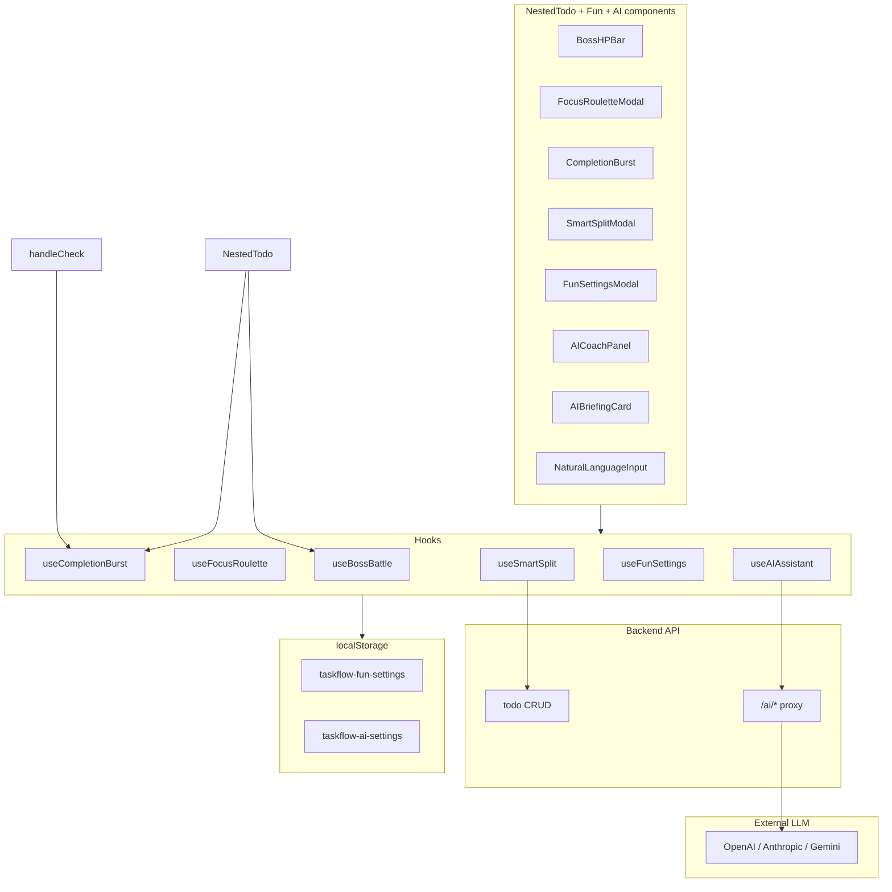

# TaskFlow “Fun Stack” — End-to-End Implementation Plan

This plan covers the **Fun Stack** plus an optional **AI Stack** for TaskFlow:

### Fun Stack (frontend-only v1)
1. **Boss Battle Mode** — parent tasks as bosses, subtasks chip HP
2. **Focus Roulette** — weighted random “pick my next task”
3. **Completion Burst** — short celebration on task complete
4. **Smart Split** — paste a list → auto-create subtasks (regex parser v1)

### AI Stack (requires backend proxy — Sprint 3)
5. **AI Smart Split** — LLM-powered task breakdown
6. **AI Focus Coach** — explains *why* to do a task next
7. **AI Boss Lore** — generates boss name + taunt for parent tasks
8. **AI Daily Briefing** — morning summary of your workspace
9. **Natural Language Add** — “add school with math, science, english subtasks”

**Fun Stack v1** uses the existing frontend architecture (`NestedTodo.tsx`, `todoService`, localStorage). **AI features require a backend proxy** so API keys never live in the browser.

---

## Current foundation (what we build on)

| Already exists | Used by |
|----------------|---------|
| Nested `Todo` tree (`parentId`, `subTodos`) | Boss Battle, Smart Split |
| `countAll` / `calculateProgress` | Boss HP math |
| `usePriority` (localStorage) | Roulette weighting |
| `handleCheck` + cascade | Boss defeat, Completion Burst trigger |
| Theme Studio + CSS vars | Burst colors, boss UI |
| Drag-and-drop order | Unchanged |
| `SmartSplitModal` (started) | Regex Smart Split v1; AI upgrade path |

**Fun Stack constraint:** API only supports single-task `createTodo({ text, parentId })`. Smart Split batch-creates via multiple API calls.

**AI Stack constraint:** LLM calls **must** go through your FastAPI/Node backend — never `VITE_OPENAI_KEY` in the frontend.

---

## High-level architecture



---

## Shared foundation (Phase 0 — do this first)

**Goal:** One settings layer so every feature can be toggled without cluttering `NestedTodo`.

### 0.1 Types — `src/types/fun.types.ts`

```typescript
export interface FunSettings {
  bossBattleEnabled: boolean;
  focusRouletteEnabled: boolean;
  completionBurstEnabled: boolean;
  completionBurstIntensity: "subtle" | "normal" | "epic";
  smartSplitEnabled: boolean;
  rouletteIncludeSubtasks: boolean;
  // AI toggles (Sprint 3)
  aiEnabled: boolean;
  aiSmartSplitEnabled: boolean;
  aiFocusCoachEnabled: boolean;
  aiBossLoreEnabled: boolean;
  aiBriefingEnabled: boolean;
  aiNaturalLanguageAddEnabled: boolean;
}

export interface AISettings {
  provider: "openai" | "anthropic" | "gemini" | "backend-default";
  /** Set on backend only — never in frontend localStorage */
  model?: string;
  maxTokensPerRequest: number;
  dailyRequestLimit: number;
}

export interface AISplitResponse {
  title: string;
  subtasks: string[];
  reasoning?: string;
}

export interface AICoachResponse {
  taskId: number;
  taskText: string;
  recommendation: string;
  estimatedMinutes?: number;
  prioritySuggestion?: "high" | "medium" | "low" | "none";
}

export interface AIBossLoreResponse {
  bossName: string;
  taunt: string;
  defeatMessage: string;
}

export interface AIBriefingResponse {
  greeting: string;
  summary: string;
  topPriorities: string[];
  encouragement: string;
}
```

### 0.2 Hook — `src/hooks/useFunSettings.ts`

- Load/save `taskflow-fun-settings` in localStorage
- Defaults: all **on**, burst **normal**
- Expose `settings`, `updateSetting`, `resetDefaults`

### 0.3 Settings UI entry points

- Sidebar: small **“Fun”** section (collapsible), or
- Header: sparkle icon → `FunSettingsModal` (small dialog)
- Theme Studio stays separate; Fun settings are gameplay, not colors

### 0.4 Pure utilities — `src/lib/funUtils.ts`

| Function | Purpose |
|----------|---------|
| `getBossHp(todo: Todo)` | Reuse `calculateProgress` inverted: HP = 100 − progress% |
| `isBoss(todo)` | Top-level task with ≥0 subtasks (or always top-level in v1) |
| `pickWeightedRandom(candidates)` | Roulette core |
| `parseBulletList(text: string)` | Smart Split parser |

**Phase 0 exit criteria:** Settings persist; toggles hide/show UI shells without errors.

**Estimate:** 0.5–1 day

---

## Feature 1 — Boss Battle Mode

### Concept

- Each **top-level task with subtasks** = a boss
- **HP** = % of subtasks *not* done (recursive, same as progress logic)
- Checking a subtask → boss takes damage → brief shake/flash
- All subtasks done (HP 0) → **DEFEATED** state + optional burst
- Leaf tasks (no subtasks) → no boss bar; normal checkbox behavior

### UX spec

| Location | Behavior |
|----------|----------|
| **Board card** | Boss HP bar under title; red/orange gradient; HP label = `{100 - progress}%` |
| **List view** | Thin HP strip on top-level rows with children |
| **Sidebar progress** | Optional skull icon on boss tasks under 50% HP |
| **On damage** | Card shakes 300ms; HP bar animates down |
| **On defeat** | Green “DEFEATED” badge; card border turns success color |

### Technical design

**No new API fields.** HP is derived:

```typescript
function getBossHp(task: Todo): number {
  if (!task.subTodos?.length) return task.done ? 0 : 100;
  return 100 - calculateProgress(task);
}
```

**New files**

| File | Role |
|------|------|
| `src/components/boss/BossHPBar.tsx` | Reusable bar + label |
| `src/components/boss/BossDefeatedBadge.tsx` | Small badge |
| `src/hooks/useBossBattle.ts` | `onSubtaskComplete(parentId)`, animation state map |

**Integration in `TodoCard`**

- If `settings.bossBattleEnabled && item.subTodos?.length` → render `BossHPBar`
- Replace generic progress label with “Boss HP” when enabled
- On `handleCheck` success for a child → call `triggerDamage(parentId)`

**Animation state (local, ephemeral)**

```typescript
// useBossBattle.ts
const [damagedIds, setDamagedIds] = useState<Set<number>>(new Set());
// Add parent id on check, remove after 400ms
```

### Edge cases

| Case | Behavior |
|------|----------|
| Parent checked (cascade completes all) | Instant defeat animation |
| Subtask unchecked | HP goes back up (no “healing” animation needed v1) |
| Task with 0 subtasks | No boss UI |
| Search filtered out | Boss state unchanged |

### Acceptance criteria

- [ ] Boss bar only on tasks with subtasks
- [ ] HP matches sidebar/card progress math
- [ ] Damage animation fires on subtask complete
- [ ] Defeated state when progress hits 100%
- [ ] Toggle off → classic progress bar returns

**Estimate:** 1.5–2 days

---

## Feature 2 — Focus Roulette

### Concept

User clicks **“Spin”** → app picks one incomplete task → highlights it + scrolls into view.

### Weighting

| Factor | Weight multiplier |
|--------|-------------------|
| Base | 1 |
| Priority high | ×3 |
| Priority medium | ×2 |
| Has subtasks incomplete | ×1.5 |
| Top-level vs nested | Include **actionable** items only |

**Candidate pool (v1):** Use current `filteredTodos` tree — incomplete tasks only. Optional toggle: “Include subtasks” in Fun settings.

### UX spec

1. Button in header or greeting row: **“Focus Roulette”** with dice icon
2. Modal opens → spinning animation ~1.2s (cycle through names)
3. Lands on winner → “Your focus: **school**”
4. Buttons: **Go to task** (scroll + pulse highlight) · **Spin again** · **Close**
5. Keyboard: `G` then `R` (add to `useKeyboardShortcuts`)

### Technical design

**New files**

| File | Role |
|------|------|
| `src/hooks/useFocusRoulette.ts` | Build candidates, spin logic |
| `src/components/focus/FocusRouletteModal.tsx` | UI + animation |
| `src/lib/funUtils.ts` | `pickWeightedRandom`, `flattenIncompleteTasks(todos)` |

**Highlight mechanism**

- Set `focusedTaskId` in `NestedTodo` state
- Pass to cards/list items → `ring-2 ring-[var(--tf-accent)] animate-pulse` for 3s
- `document.getElementById('task-${id}')?.scrollIntoView({ behavior: 'smooth' })` — add `id` to card wrappers

### Acceptance criteria

- [ ] Never picks completed tasks
- [ ] High-priority tasks picked more often (statistically)
- [ ] Empty pool → “Nothing to spin — you’re clear!”
- [ ] Works in board and list view
- [ ] Respects Fun settings toggle

**Estimate:** 1–1.5 days

---

## Feature 3 — Completion Burst

### Concept

When a task is marked **done**, show a brief celebration — themed to custom theme colors.

### Intensity levels

| Level | Effect |
|-------|--------|
| **Subtle** | Checkbox scale bounce + soft glow on row |
| **Normal** | 12–20 particles from checkbox, fade 600ms |
| **Epic** | Particles + card flash + optional screen-edge vignette |

### Technical design

**New files**

| File | Role |
|------|------|
| `src/components/fun/CompletionBurst.tsx` | Canvas or DOM particles |
| `src/hooks/useCompletionBurst.ts` | Queue bursts by `{ x, y, taskId }` |

**Trigger point (single place)**

In `handleCheck`, after successful API + `fetchTodos`:

```typescript
if (settings.completionBurstEnabled && newStatus === true) {
  burstAtElement(checkboxRef or cardRef);
}
```

**Implementation (recommended):**

- **DOM/CSS particles** (no new deps): ~15 `div` dots with CSS `@keyframes`, colors from `--tf-accent`, `--tf-accent-2`
- Position via `getBoundingClientRect()` on the checkbox
- Portal to `document.body` so overflow doesn’t clip

**Boss integration:** When boss HP hits 0, fire **epic** burst once at card center (even if intensity is normal).

### Performance rules

- Max 1 burst per 200ms (debounce rapid checks)
- No burst on cascade bulk (optional): only **directly clicked** task in v1
- `prefers-reduced-motion` → subtle only

### Acceptance criteria

- [ ] Burst fires on manual complete
- [ ] Uses theme accent colors when custom theme active
- [ ] Off when setting disabled
- [ ] Respects reduced motion

**Estimate:** 1–1.5 days

---

## Feature 4 — Smart Split

### Concept

User pastes multi-line text → preview parsed items → creates one parent + N subtasks (or subtasks under existing parent).

### Parser rules — `parseBulletList(text)`

Input examples:

```
Plan trip
- Book flight
- Book hotel
* Pack bags
1. Get visa
2. Buy insurance
```

Output:

```typescript
{ title?: string; items: string[] }
```

Rules:

- First non-bullet line → optional **parent title**
- Lines starting with `-`, `*`, `•`, `\d+.` → subtask
- Strip bullets/numbers, trim, drop empty
- Max 20 subtasks per split (guardrail)

### UX spec

1. **Entry:** “Smart Split” button near Add Task, or `Ctrl+Shift+V` when input focused
2. **Modal:** Large textarea + live preview list
3. **Options:**
   - Create new parent + subtasks
   - Add subtasks to selected task (dropdown of top-level incomplete)
4. **Confirm** → progress “Creating 5 subtasks…”
5. **Done** → toast + refresh todos

### API flow (sequential — no bulk endpoint)

```typescript
async function smartSplitCreate(parentText: string, items: string[]) {
  const parent = await todoApi.createTodo({ text: parentText });
  for (const text of items) {
    await todoApi.createTodo({ text, parentId: parent.id });
  }
  await fetchTodos();
}
```

**UX during create:** Disable modal, show spinner, allow cancel only before start.

### Error handling

- Partial failure (3/5 created) → toast warning + refresh
- Duplicate names → allow in v1 (duplicate detector = phase 2)

### Acceptance criteria

- [ ] Parses common bullet formats
- [ ] Preview matches what will be created
- [ ] Creates correct parent/child structure
- [ ] Works with existing nested tree
- [ ] Loading/error states clear

**Estimate:** 1.5–2 days

---

## AI Stack (Sprint 3)

AI features upgrade the Fun Stack with intelligence. They are **genuine** when they save time or give real advice — **gimmick** when they only add fluff text.

### Security rule (non-negotiable)

```
Browser  →  POST /ai/* (JWT auth)  →  Backend  →  LLM API
                ↑
         API key lives HERE only
```

- Never store OpenAI/Anthropic keys in `VITE_*` env vars exposed to the client
- Rate-limit per user on backend (`dailyRequestLimit` in settings)
- Send minimal context: task titles + done status only (no emails/passwords)

### Backend endpoints (add to FastAPI or Node)

| Endpoint | Body | Response |
|----------|------|----------|
| `POST /ai/split` | `{ text: string, parentId?: number }` | `AISplitResponse` |
| `POST /ai/coach` | `{ todos: TodoSummary[], focusTaskId?: number }` | `AICoachResponse` |
| `POST /ai/boss-lore` | `{ taskText: string, subtaskCount: number, progress: number }` | `AIBossLoreResponse` |
| `POST /ai/briefing` | `{ todos: TodoSummary[], userName: string }` | `AIBriefingResponse` |
| `POST /ai/parse-task` | `{ input: string }` | `{ parent: string, subtasks: string[] }` |

`TodoSummary` = `{ id, text, done, priority?, subtaskCount, parentText? }` — strip PII before sending.

**Env vars (backend `.env` only):**

```env
AI_PROVIDER=openai
OPENAI_API_KEY=sk-...
AI_MODEL=gpt-4o-mini
AI_MAX_REQUESTS_PER_USER_PER_DAY=50
```

---

## Feature 5 — AI Smart Split (upgrade)

### Concept

Same UX as Smart Split, but user toggles **“Use AI”** for messy input:

```
"plan my vacation next month need flights hotel and pack"
→ title: "Plan vacation"
→ subtasks: ["Book flights", "Reserve hotel", "Make packing list", ...]
```

Regex parser remains as **free offline fallback** when AI is off or request fails.

### UX

- Smart Split modal: toggle **AI ✨** (on if `aiSmartSplitEnabled`)
- Shows AI reasoning in collapsible “Why these steps?”
- Loading: shimmer on preview list
- Error → “AI unavailable — used basic split instead”

### Frontend

| File | Role |
|------|------|
| `src/services/aiService.ts` | `aiApi.split(text)` |
| `src/hooks/useAISmartSplit.ts` | Wraps existing `useSmartSplit` |

### Prompt template (backend)

```
You are a task breakdown assistant. Given user input, return JSON:
{ "title": string, "subtasks": string[] (max 12, actionable, short) }
Input: "{{userText}}"
```

### Acceptance criteria

- [ ] AI split produces better results than regex on paragraph input
- [ ] Falls back to regex parser on error
- [ ] User can preview before creating
- [ ] Respects daily rate limit

**Estimate:** 1.5 days (frontend 0.5 + backend 1)

---

## Feature 6 — AI Focus Coach

### Concept

Upgrades Focus Roulette: instead of only random pick, AI **recommends one task with a one-sentence reason**.

Example:

> **Do “math homework” next** — it’s high priority and you’re 67% through the school boss; finishing this drops boss HP significantly.

### UX

- Focus Roulette modal: tab **Random** | **AI Coach**
- Coach tab: “Analyzing your tasks…” → shows recommendation card
- Buttons: **Start this task** (scroll + highlight) · **Pick another** · **Ask again**

### Integration

- Reuses `focusedTaskId` highlight from Roulette
- Optionally auto-sets priority if user confirms `prioritySuggestion`

### Prompt context (backend)

Send flattened incomplete tasks (max 30) with priority + boss HP + overdue flags.

### Acceptance criteria

- [ ] Never recommends completed tasks
- [ ] Reason references real task names from workspace
- [ ] Works when AI off (Random tab still works)
- [ ] Response under 3 seconds or show timeout message

**Estimate:** 1.5 days

---

## Feature 7 — AI Boss Lore

### Concept

When Boss Battle is on, AI generates flavor for parent tasks with subtasks:

| Field | Example |
|-------|---------|
| **Boss name** | “The Homework Hydra” |
| **Taunt** (HP > 50%) | “Three heads, zero progress!” |
| **Defeat line** (HP 0%) | “The hydra falls. School boss defeated.” |

Stored in **localStorage** cache keyed by `taskId + task.updatedAt` so lore doesn’t regenerate every render.

### UX

- Boss HP bar shows AI name instead of raw task title (subtitle shows real title)
- Taunt appears on card hover or when boss takes damage
- Toggle off in Fun settings → plain task names

### Acceptance criteria

- [ ] Lore cached per task; regenerates only when task text changes
- [ ] Graceful fallback to task title if AI fails
- [ ] Fits Boss Battle theme (playful, not offensive)

**Estimate:** 1 day

---

## Feature 8 — AI Daily Briefing

### Concept

On first visit each day (or click **“Daily Briefing”** in greeting row), AI generates a short briefing:

> Good evening, xxx. You have 3 active bosses. Focus on **house** first — it has the most subtasks left. You’re 0% overall; one win tonight changes the mood.

### UX

- Collapsible card under greeting (dismissible for the day)
- Uses theme accent styling
- “Refresh briefing” button (counts toward rate limit)

### Storage

`taskflow-briefing-date` = last shown date; don’t auto-show twice same day unless refreshed.

### Acceptance criteria

- [ ] Accurate task counts (matches sidebar progress)
- [ ] Max 3 sentences + bullet priorities
- [ ] Dismiss persists until next calendar day

**Estimate:** 1 day

---

## Feature 9 — Natural Language Add

### Concept

Enhance the main task input: user types natural language, AI parses into parent + subtasks.

```
"create school project with research, draft, and presentation subtasks"
→ Creates parent "School project" + 3 subtasks in one action
```

### UX

- Sparkle icon inside Add Task bar
- Or prefix input with `/ai ` trigger
- Preview confirm dialog before batch create

### Acceptance criteria

- [ ] Parses multi-part requests correctly
- [ ] Plain text without AI intent still uses normal single-task create
- [ ] Clear preview before API creates anything

**Estimate:** 1 day

---

## AI file structure (new)

```
todo/src/
├── types/
│   └── ai.types.ts          # AISplitResponse, AICoachResponse, etc.
├── services/
│   └── aiService.ts         # aiApi.split, coach, briefing, ...
├── hooks/
│   └── useAIAssistant.ts    # shared loading, error, rate limit state
└── components/
    └── ai/
        ├── AICoachPanel.tsx
        ├── AIBriefingCard.tsx
        ├── AIBossLoreLabel.tsx
        └── NaturalLanguagePreview.tsx

backend/  (FastAPI or Node — separate repo or sibling folder)
├── routes/
│   └── ai.py | ai.routes.ts
├── services/
│   └── llm_client.py | llmClient.ts
└── prompts/
    ├── split.txt
    ├── coach.txt
    └── briefing.txt
```

---

## AI: fun vs genuine

| Feature | Verdict | Why |
|---------|---------|-----|
| **AI Smart Split** | ✅ Genuine | Saves real time vs manual subtasks |
| **AI Focus Coach** | ✅ Genuine | Answers “what should I do?” with reasoning |
| **AI Daily Briefing** | ✅ Genuine | Orientation at start of session |
| **Natural Language Add** | ✅ Genuine | Faster task entry |
| **AI Boss Lore** | ⚡ Fun garnish | Delightful but optional; disable if distracting |
| **AI rewrite task titles** | ❌ Skip v1 | Low value, high annoyance risk |
| **AI chat about anything** | ❌ Skip v1 | Scope creep; not a todo app |

---

## Updated implementation phases

| Phase | Features | Estimate |
|-------|----------|----------|
| **0** | Fun settings + utils | 0.5–1 day |
| **1** | Completion Burst + Boss Battle | 2–3 days |
| **2** | Focus Roulette + Smart Split (regex) | 2–3 days |
| **3** | Backend AI proxy + AI Smart Split + NL Add | 2–3 days |
| **4** | AI Coach + Briefing + Boss Lore | 2–3 days |
| **5** | Polish, rate limits, error fallbacks | 1 day |

**Total with AI:** ~10–14 dev days

```mermaid
gantt
  title TaskFlow Fun + AI Stack
  dateFormat X
  axisFormat %s

  section Fun
  Phase 0-2 Fun Stack        :0, 7

  section AI
  Backend AI proxy           :7, 9
  AI Split + NL Add            :9, 11
  AI Coach + Briefing + Lore   :11, 14
```



---

## Updated sprints

### Sprint 1 (~3 days) — Fun core
Phase 0 + Completion Burst + Boss Battle

### Sprint 2 (~3 days) — Fun tools
Focus Roulette + Smart Split (regex) + shortcuts/polish

### Sprint 3 (~3 days) — AI foundation
Backend `/ai/*` proxy + AI Smart Split + Natural Language Add

### Sprint 4 (~2 days) — AI personality
AI Focus Coach + Daily Briefing + Boss Lore + rate limits

---

## AI testing plan

| Feature | Test |
|---------|------|
| AI Split | Paragraph input → sensible subtasks; fallback on 500 error |
| AI Coach | Recommends incomplete task; reason mentions task name |
| Boss Lore | Cached; new lore when task renamed |
| Briefing | Counts match sidebar; dismiss until tomorrow |
| NL Add | “school with math and english” → 1 parent + 2 subs |
| Security | No API key in network tab from browser to LLM directly |
| Rate limit | 51st request same day → friendly “limit reached” |

---

## Optional Phase 5 (later)

| Idea | Needs |
|------|--------|
| Streak heatmap | localStorage + completion timestamps |
| Achievements | `useAchievements` hook |
| Duplicate detector | Compare normalized `text` on create |
| Backend bulk create | `POST /todos/bulk` |
| **Local LLM (Ollama)** | Backend routes to `localhost:11434` for privacy mode |
| **Voice → AI parse** | Web Speech API + `/ai/parse-task` |

---

## Fun file structure (implemented / planned)

```
todo/src/
├── types/
│   ├── fun.types.ts
│   └── ai.types.ts              # Sprint 3
├── hooks/
│   ├── useFunSettings.ts
│   ├── useBossBattle.ts
│   ├── useFocusRoulette.ts
│   ├── useCompletionBurst.ts
│   ├── useSmartSplit.ts
│   └── useAIAssistant.ts          # Sprint 3
├── lib/
│   └── funUtils.ts
├── services/
│   └── aiService.ts             # Sprint 3
└── components/
    ├── fun/
    │   ├── FunSettingsModal.tsx
    │   ├── BossHPBar.tsx
    │   ├── BossDefeatedBadge.tsx
    │   ├── FocusRouletteModal.tsx
    │   ├── SmartSplitModal.tsx
    │   └── CompletionBurst.tsx
    └── ai/                      # Sprint 3
        ├── AICoachPanel.tsx
        ├── AIBriefingCard.tsx
        ├── AIBossLoreLabel.tsx
        └── NaturalLanguagePreview.tsx
```

**Touch existing:** `NestedTodo.tsx`, `useKeyboardShortcuts.ts`, `ShortcutsModal.tsx`, `api.config.ts` (AI endpoints).

---

## `NestedTodo.tsx` integration map

| Existing piece | Fun Stack | AI Stack |
|----------------|-----------|----------|
| `handleCheck` | Burst; boss damage | — |
| `TodoCard` | Boss HP bar; task id for scroll | Boss lore label |
| Greeting row | Roulette + Smart Split buttons | Briefing card |
| Header | Fun settings icon | — |
| Add Task input | — | NL parse sparkle |
| `SmartSplitModal` | Regex split | AI toggle |
| `FocusRouletteModal` | Random spin | AI Coach tab |

---

## Settings defaults

```typescript
const DEFAULT_FUN_SETTINGS: FunSettings = {
  bossBattleEnabled: true,
  focusRouletteEnabled: true,
  completionBurstEnabled: true,
  completionBurstIntensity: "normal",
  smartSplitEnabled: true,
  rouletteIncludeSubtasks: false,
  // AI — off by default until backend is configured
  aiEnabled: false,
  aiSmartSplitEnabled: true,
  aiFocusCoachEnabled: true,
  aiBossLoreEnabled: true,
  aiBriefingEnabled: true,
  aiNaturalLanguageAddEnabled: true,
};
```

---

## Testing plan (manual — Fun Stack)

| Feature | Test |
|---------|------|
| Boss | Create parent + 3 subs; complete 1 → HP 67%; complete all → defeated |
| Boss off | Toggle → normal progress bar |
| Roulette | 10 spins with 1 high-priority task → picked more often |
| Roulette empty | All done → friendly message |
| Burst | Complete task → particles; reduced motion → subtle only |
| Smart Split | Paste 5 bullets → 5 subs under new parent |
| Smart Split fail | Stop backend mid-batch → partial create message |
| Theme | Volcanic theme → burst uses orange, not indigo |

---

## Success metrics

| Stack | Metric |
|-------|--------|
| Boss Battle | HP matches progress; defeat feels earned |
| Roulette | One-click “what next?” |
| Burst | Satisfying without slowing workflow |
| Smart Split | Project breakdown in <10 seconds |
| AI Split | Paragraph → sensible subtasks vs regex |
| AI Coach | Recommendation cites real task names |
| AI Briefing | Counts match sidebar |

---

## Fun vs genuine (design principles)

**Genuine** = uses real task data and solves a real moment:

| Moment | Solution |
|--------|----------|
| “I can’t choose what to do” | Roulette → **AI Coach** |
| “This feels overwhelming” | Boss Battle |
| “Breaking this down is tedious” | Smart Split → **AI Smart Split** |
| “Completing tasks feels flat” | Completion Burst |
| “What’s my plan today?” | **AI Daily Briefing** |
| “I don’t want to format bullets” | **Natural Language Add** |

**Fun garnish (optional toggles):** AI Boss Lore

**Defer:** multiplayer, leaderboards, generic AI chat, voice input (v2)

---

## Recommended build order (summary)

1. **Sprint 1** — Completion Burst + Boss Battle  
2. **Sprint 2** — Focus Roulette + Smart Split (regex)  
3. **Sprint 3** — Backend `/ai/*` + AI Smart Split + NL Add  
4. **Sprint 4** — AI Coach + Briefing + Boss Lore  

**Total:** ~10–14 dev days (Fun + AI)
